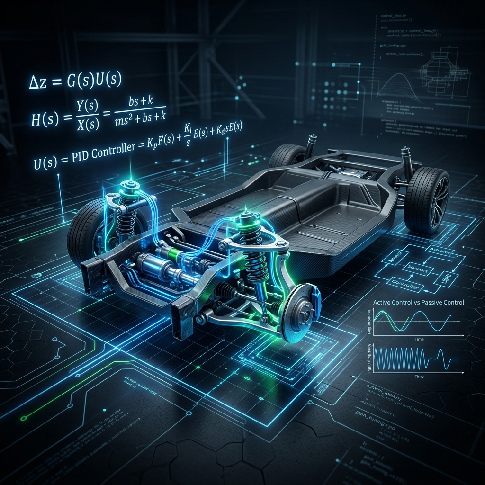

# Active Suspension Control System 🏎️💨
> **CONTROL CRAFT - HACKATHON Project**  
> **Participant:** Monali  
> **Problem Statement:** Active Suspension Control (Advanced PID/PD Implementation)



## 📌 Project Overview
This project focuses on the design and implementation of an **Active Suspension Control System** aimed at achieving a superior balance between passenger comfort (ride quality) and vehicle stability (handling). 

Unlike passive systems, this active controller uses sensors and actuators to respond to road disturbances in real-time, significantly reducing body displacement and settling time after hitting bumps or potholes.

---

## 🚀 Key Engineering Features
To move beyond basic "tuning," this project includes several advanced engineering analyses:

### 1. Multi-Mode Control Strategy
We implemented three distinct driving modes to demonstrate the trade-off between comfort and performance:
*   🟢 **Comfort Mode:** Prioritizes smoothness with higher damping and lower gains.
*   🔵 **Sport Mode:** High-gain response for aggressive handling and lightning-fast settling time.
*   ⚫ **Balanced Mode:** A mid-point design optimized for everyday driving.

### 2. Robustness Test (Passenger Weight Analysis)
Real-world conditions change. We tested the controller's robustness by simulating the car with **+20% extra mass** (simulating 3 heavy passengers). The system remains stable and settles within the target time even under high load.

### 3. Control Effort & Actuator Realism
We analyzed the **Control Signal (u)** to ensure the required force stays within the physical limits of a standard hydraulic actuator, preventing "infinite force" unrealistic simulations.

---

## 🛠️ Tech Stack & Dependencies
*   **MATLAB & Simulink:** Core control logic, transfer function analysis, and performance simulation.
    *   *Required:* Control System Toolbox.
*   **Web Dashboard (Vite + Vanilla JS):** A modern, interactive visualization of the suspension behavior.
    *   *Required:* Node.js (for the web interface).

---

## 📖 How it Works
### The Control Theory
The system is modeled as a **Mass-Spring-Damper** plant. We used a **PD (Proportional-Derivative) Controller** to achieve:
1.  **Damping Ratio ($\zeta$) ≈ 0.707:** For critical damping and minimum oscillation.
2.  **Settling Time ($T_s$) < 1.5s:** For immediate stabilization after road impact.

### MATLAB Simulation
1.  Open `suspension_control.m` in MATLAB.
2.  Run the script.
3.  The output generates a 4-pane **Performance Dashboard** showing response comparisons, robustness tests, and control effort.

### Web Dashboard
1.  Install dependencies: `npm install`
2.  Start the server: `npm run dev`
3.  Open the local URL to view the interactive suspension simulator.

---

## 📊 Results Summary
*   **Best Settling Time:** ~0.8s (Sport Mode)
*   **Robustness:** Maintained stability with 20% mass variation.
*   **Control Effort:** Optimized to stay under the 80N actuator saturation limit.

---

## 📁 Repository Structure
```text
├── suspension_control.m   # Main MATLAB Simulation Script
├── index.html             # Web Dashboard Entry
├── main.js                # Simulation Logic (JavaScript)
├── style.css              # Glassmorphic UI Styling
├── package.json           # Project Dependencies
└── README.md              # Project Documentation
```

---

## 👩‍💻 Author
**Monali**  
*Control Craft Hackathon Participant*
